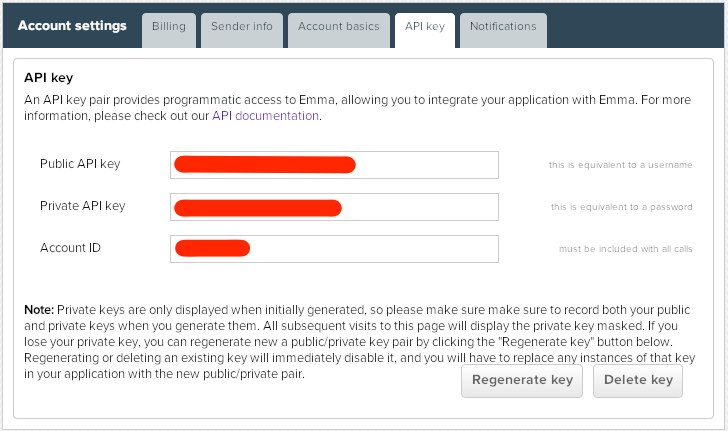

# Introduction

## Welcome to the Emma API!

### A Word To The Wise...

Use the documentation here to set up and troubleshoot your API calls. We don’t offer one-on-one support for Emma’s public API, but our system is monitored around the clock. If there’s ever a dropped connection or outage, we’ll notify users on our status page.

### Overview

Emma’s platform is accessible through our public API. The API provides access to the following areas:

1. Managing member lists
    - importing, editing, deleting
    - organizing members into groups
    - searching for members
2. Mailings
    - viewing past mailings
    - controlling the status of pending mailings
3. Retrieving response
    - Access mailing response information by mailing, member of time period
    - Access response at summary and detail levels

## API Wrappers

Emma’s wrappers make it easy to connect to our API in the programming language you’re working in. Just select your language to integrate with Emma without having to study all the ins and outs of our API first.

This collection is young, but growing, and includes wrappers commissioned by Emma, as well as those built by members of our community. Unless otherwise noted, all wrappers provide full coverage of our current API. If you see something that needs to be fixed or improved, please don’t hesitate to fork the repo and submit a pull request. And if you’ve built a wrapper that you would like listed here, let us know!

### PHP
[EmmaPHP](https://github.com/myemma/EmmaPHP): Commissioned by Emma and built by Nashville developer Dennis Monsewicz.

[OhMyEmma](https://github.com/jwoodcock/OhMyEmma): Built by Nashville developer Jacques Woodcock.

[Emma](https://github.com/markroland/emma): Built by Nashville-based Abenity, Inc.

### Python
[EmmaPython](https://github.com/myemma/EmmaPython): Built by Emma’s own Doug Hurst.

### Ruby
[EmmaRuby](https://github.com/myemma/EmmaRuby): Commissioned by Emma and built by Nashville developer Dennis Monsewicz.

### Objective-C
[EmmaSDK](https://github.com/myemma/EmmaSDK): Commissioned by Emma and built by Portland developer Benjamin Van Der Veen.

### Node.js
[emma-sdk](https://github.com/nathanpeck/emma-sdk): Built by New York City developer Nathan Peck for StoryDesk.

# Quickstart

## Authentication

> So, let’s add these authentication bits to our code.

```php
// Authentication Variables
$account_id = "xxx";
$public_api_key = "xxx";
$private_api_key = "xxx";
```

Let’s start by building some PHP code that will add a member to our audience.

First, you&rsquo;ll want to figure out how to authenticate. All calls require HTTP Basic Auth authentication. Inside your Emma account, in the “Account Settings” section, you’ll find your API keys. There’s a public key and a private key and an account ID. It should look like this.



## Capture variables

```php
// Form variable(s)
$email = $_POST['email'];
$first_name = $_POST['first_name'];
$last_name = $_POST['last_name'];
$groups = array(123456, 654321);

// Member data other than email should be passed in an array called "fields"
$member_data = array(
  "email" => $email,
  "fields" => array(
    "first_name" => $first_name,
    "last_name" => $last_name
  ),
  "group_ids" => $groups
);
```

Then, we’ll want to capture the POSTed form variables from the request.

Please note that the `group_ids` to which the member will be added are passed as an array of integers. Of course, you’ll want to make sure you sanitize any of these form inputs to protect your application.

Let’s set the URL for the API call. The endpoint for all of our API calls is https://api.e2ma.net/. In this case, we’re using the endpoint that corresponds to adding a single member. There’s a separate call for adding bulk members.

## Set URL

```php
// Set URL
$url = "https://api.e2ma.net/".$account_id."/members/add";
```

## Execute cURL command

```php
// setup and execute the cURL command
$ch = curl_init();
curl_setopt($ch, CURLOPT_USERPWD, $public_api_key . ":" . $private_api_key);
curl_setopt($ch, CURLOPT_URL, $url);
curl_setopt($ch, CURLOPT_POST, count($member_data));
curl_setopt($ch, CURLOPT_POSTFIELDS, json_encode($member_data));
curl_setopt($ch, CURLOPT_HTTPHEADER, array('Content-type: application/json'));
curl_setopt($ch, CURLOPT_RETURNTRANSFER, true);
curl_setopt($ch, CURLOPT_SSL_VERIFYPEER, false);
$head = curl_exec($ch);
$http_code = curl_getinfo($ch, CURLINFO_HTTP_CODE);
curl_close($ch);
```

Next, we’ll do a little dance with cURL that I’m sure is familiar. I’ll explain some particulars below the code block.

On line 3 is where we use the public/private keys to authenticate our call. On lines 6-7, we force the API call to make its request in JSON and expect JSON in return.

## Results

```php
//execute post
if($http_code > 200) {
  $app_message = "Error sending subscription request";
} else {
  $app_message = "Success!";
}

echo $app_message;
```

At this point, the API call has been made.We might want to inspect the result to see what happened. The API returns true HTTP response codes which you can examine to determine a request’s disposition.

You can [see the complete PHP script here](http://api.myemma.com/php_signup_example.html). Additionally, there’s a PHP example to [get members using their email address](http://api.myemma.com/php_get_member_example.html).

To extend this example further, one could make the API call associate the new member with a particular signup form. As written above, the member would be added to the audience but would not appear in the “recent activity” type searches or really any searches related to signups. We are working on a cleaner way to handle this signup form issue in the future.
